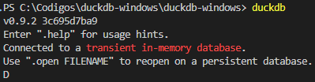
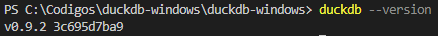

# Instalando o duckDB cli no Windows

### O que é o DuckDB?

O DuckDB é um banco de dados relacional de código aberto, embarcado (similar ao SQLite), orientado a coluna, conhecido por sua velocidade e eficiência em consultas analíticas (OLAP). 

### Instalação do DuckDB no Windows

Abra uma tela do Prompt de Comando / Terminal e digite o comando abaixo:

``` bash copy
winget install DuckDB.cli
```

Ao efetuar a instalação pelo winget, ele cria uma pasta em `C:\Users\<<usuario>>\AppData\Local\Microsoft\WinGet\Packages\DuckDB.cli_Microsoft.Winget.Source...`, coloca o arquivo `duckdb.exe` lá dentro e também adiciona no PATH do Windows.

### Validando instalação

``` bash copy
duckdb
```

Exemplo do comando acima:



Para sair do shell do DuckDB, pressionar `Control+Z`.

Para verificar a versão:

``` bash copy
duckdb --version
```
Exemplo do comando acima:




### Referências:
https://duckdb.org/

https://duckdb.org/docs/installation/?version=latest&environment=cli&installer=binary&platform=win

